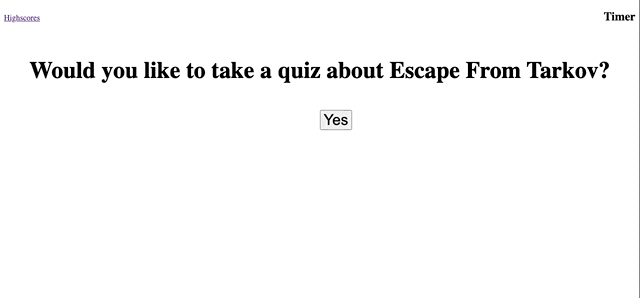

# quiz-time
A timed quiz using javascript.

# Description
This project uses javascript to run a timed quiz that stores quiz scores in local storage.

# Completed Task
- Asks if you want to take the quiz and will start the timer on input
- Scrolls though the question as they are answered
- Wrong answers subtract time from the timer
- At the end of the quiz you are presented with your score and submit your initials
- List a highscore board and from there can retake the quiz and reset the board

# Links
[Code Repository](https://github.com/Justin-Brueske/quiz-time)

[Deployed Site](https://justin-brueske.github.io/quiz-time)

# Usage 
Can be viewed in desktop or mobile web browser.
